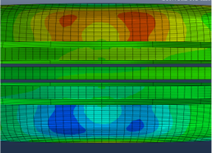
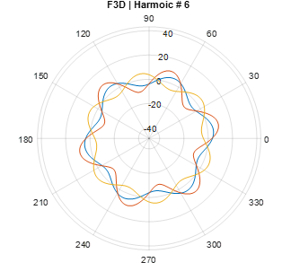
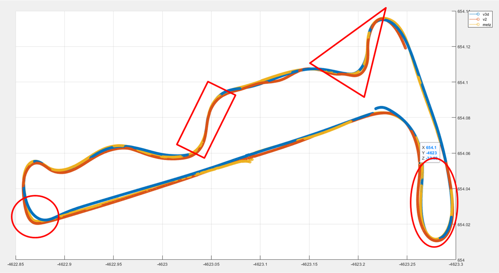

In 1992 Honda Accord gained immediate public notoriety as the car that kept giving static shocks to anyone who touched them. The problem was so severe that at toll booths, collectors would hold out their hats or a bowl for the driver to drop cash in. This was the subject of an intriguing episode of the iconic radio show Car Talk in which Tom and Ray Magliozzi, the brothers- MIT engineers turned radio hosts, managed to solve the mystery.

Anyone acquainted with motor racing, of any form, would have heard the struggle that race engineers and the strategy team go through to manage tyres. The right choice of tyres at the right time on a given track often decide the winner and is one of the key strategies that teams resort to. Away from the race track, your choice of tyres determine your vehicle's performance, fuel mileage, ride comfort and your safety.

### "Black Magic" aka Complex Engineering

Let's imagine the context. For a racing car travelling at 300 kmph, the molecules within a tyre’s contact patch touch a point on the track for two-hundredths of a second every two seconds. The molecular rubber generates surface grip – that little bit of black magic – at lightning speed. Racing is basically a chain of challenges in which the driver tries to negotiate each corner in the shortest time possible, one after the other. Thus the aim of the team is roughly to attain the capability to drive through the slowest corner on a track with the highest average speed possible. Thus the engineering challenge here is to change the direction of an extremely fast body whose only external contacts are through the tiny contact patches of the tyres to the track, with minimal loss in speed, in as little time as possible. And the forces required to do so are to be generated where the rubber touches the tarmac. (In highly aerodynamic motor sports like Formula 1 a fraction of this force is generated aerodynamically). With the the tyre being the only part of the racecar in contact with the track’s surface, every other associated component, such as wheels, suspension, chassis and even aerodynamic devices, are all designed to work in symbiosis to provide the best possible conditions for the tyre.

|
|:-:
|***Contact Patch Buckling Modes studied using FEA***
The frictional force generated by the tyre depends on an array of factors including temperature, roughness of the track, the deformation of the tyre, the shape and size of the contact patch and the type of compound. The mechanism of generation of grip is a complex phenomenon that has two dominant components: Indentation and Molecular Adhesion. Indentation refers to how the micro and macro roughness of the road causes deformation of the rubber. This strain lead to stress generation in the material that is transmitted to the wheel. Molecular adhesion refers to how the compound "sticks" instantaneously to the road surface material. This or the lack of it, is something we have all experienced- that loss of grip and a short wander of the steering wheel when we drive over a patch of dust or a paint strip on the road.

### Multi Variable Non Linear Product

The tyre is a complex composite material product. In general a car tyre contains polyester, steel and about ten different rubber compounds. A common motorcycle tyre is made with nylon, steel and about 5 different compounds. The behaviour of the tyre is the result of the properties and orientations of these components, and the multitude of variables in the manufacturing process. The complexity is a result of the non linearity of these components- viscoelastic behaviour of polymers and the engineered characteristics of wound fabric strands.

|
|:-:
|***Harmoinic Analysis of Experimental Data***

A viscoelastic material is a combination of elastic deformation, which is recoverable, and viscous deformation, which is permanent. So when deformed, it returns to its original shape, but only after a period of time. A viscoelastic material can be thought of as a spring and piston assembly. So when you push the piston the viscosity in the oil resists displacement, which generates heat, and when you let go this resistance pushes the piston back, but not to its original position. The spring then takes over and its elastic behaviour extends the piston back to its original position. Thus the displacement is out of phase with the applied force and this delay results in an energy loss in the form of heat. This phase difference - indicative of hysteresis- is key in characterising compounds in addition to the modulus. However these parameters vary greatly with temperature and the frequency at which strain operates. This general complexity and the huge set of variables has earned tyre development the moniker of 'black magic'.

### Experimental and Empirical Science

As with any other form of magic, mastery comes with exploring new techniques. Tyre development- material science, complex structure modelling, multi body dynamics, interface dynamics- like most complex sciences, has progressed as an experimental science.  Atomic force microscopy, thermogravimetry, digital image correlation, doppler vibrometry are examples of  technology used daily in the industry. 

|
|:-:
|***Data Analysis of track performance***

Tyre engineers rely heavily on developing empirical mathematical models to represent, study and predict tyre characteristics. For example, the Magic Formula tyre model developed by the legendary engineer from Delft, Hans Pacejka, provides a method to calculate lateral and longitudinal tyre forces and aligning moments for a wide range of operating conditions. Tyre engineers develop such computational models to handle the huge number of variables and reduce the number of experiments. 

### Breakthroughs and Incremental Innovation

Tyre development has been an innovative area. These days tyres are fine tuned to suit each vehicle model through co-development with vehicle manufacturers. This has been made possible by advancement in data science and statistical inference techniques. However the industry has historically been known for breakthroughs. The development of silica tyres in the mid 1980s was one revolutionary breakthrough. Engineers discovered that rolling resistance could be reduced by replacing carbon black with silica. Several current car models have been fitted with radial tires that have incorporated the silica blend. The cars are five to ten percent more fuel efficient than cars with comparable tyres without the silica blend.

One problem with the silica tyre, however, was its lack of electrical conductivity. Thus the only contact points of a car with the road became insulated. The static build up on the car's metallic body had no free path to discharge now. Thus the charges would discharge immediately when there was external contact- a dangerous premise that could cause an explosion at the gas station, or pass a shock to the cash collector at the toll booth. Car Talk hosts Tom and Ray Magliozzi figured out the reason for the 1992 Accord's shocks were the Michelin- Energy fitments, newly developed fuel efficient silica tyres. And the solution that tyre manufacturers the world over adopted? A thin line of highly conductive carbon compound sandwiched in the silica tyre tread, rightly named 'the chimney'.

     
